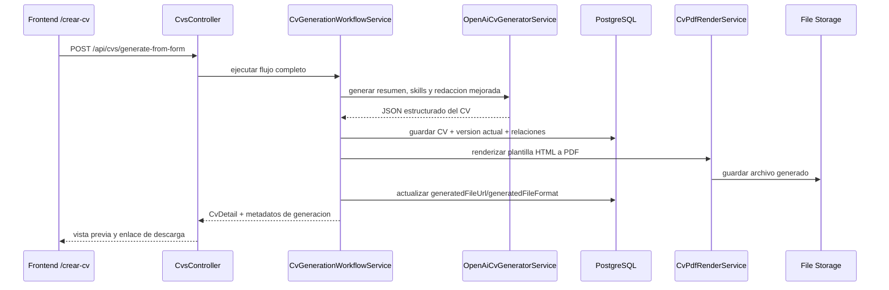

# Arquitectura objetivo del generador de CV

## Alcance

Este documento define la arquitectura del modulo 1 para generar CVs a partir del formulario de la ruta frontend `/crear-cv`.

## Objetivo funcional

El usuario completa su informacion personal, experiencia, educacion, habilidades y cargo objetivo. El sistema:

1. valida la entrada,
2. genera una version redactada con IA,
3. persiste el CV y su version actual,
4. renderiza un PDF,
5. devuelve la vista previa y el enlace al archivo generado.

## Decisiones tecnicas

### LLM

- Proveedor recomendado: Gemini mediante endpoint compatible con OpenAI.
- Libreria: `openai`.
- Configuracion por entorno:
  - `LLM_PROVIDER`
  - `LLM_API_KEY`
  - `LLM_MODEL`
  - `LLM_BASE_URL`
  - fallback opcional: `GEMINI_*` u `OPENAI_*`
- Modelo sugerido inicial: `gemini-2.5-flash`.

Razon:

- integracion simple con NestJS,
- reutiliza el SDK `openai` ya instalado,
- tiene una capa gratuita mas accesible para el MVP,
- buena calidad de redaccion en espanol,
- mejor probabilidad de obtener salida JSON estable,
- facilita reutilizacion en el modulo 2.

### Generacion de documentos

- Motor: `puppeteer`.
- Estrategia: renderizar plantilla HTML/CSS del CV y exportar PDF.
- Formato inicial: PDF.
- Formato diferido: DOCX, solo cuando el flujo base este estable.

Razon:

- PDF es el entregable mas simple para un MVP,
- HTML/CSS permite controlar mejor el disenio,
- evita maquetacion manual de bajo nivel con librerias de PDF puras.

## Principio de arquitectura

El modulo `cvs` sigue siendo la fuente de verdad del dominio. La IA y la generacion de archivos deben vivir como una capa de orquestacion encima del modulo existente, no como un reemplazo de `CvsService`.

## Componentes propuestos

### Frontend

- Ruta: `/crear-cv`
- Archivo actual: `cvpilot-prototipo/src/pages/CrearCV.tsx`
- Cliente API existente: `cvpilot-prototipo/src/lib/api/index.ts`

Responsabilidades nuevas:

- mapear el formulario al payload backend,
- ejecutar la mutacion de creacion o generacion,
- mostrar estado de carga y errores,
- renderizar vista previa real con la respuesta del backend,
- permitir descargar el PDF generado.

### Backend actual reutilizable

- `CvsController`
- `CvsService`
- DTO `CreateCvDto`
- Entidades `Cv`, `CvVersion`, `CvPersonalDetail`, `CvWorkExperience`, `CvEducationEntry`, `Skill`, `CvVersionSkill`

### Backend nuevo propuesto

#### `CvGenerationWorkflowService`

Capa de aplicacion. Orquesta validacion, llamada al proveedor IA, persistencia y renderizado del documento.

#### `OpenAiCvGeneratorService`

Encapsula la llamada al SDK `openai` contra un proveedor compatible. Por defecto debe apuntar a Gemini y devolver JSON estructurado.

#### `CvPromptBuilderService`

Construye prompts y reglas de salida para el LLM. Debe mantener el prompt fuera de `CvsService`.

#### `CvPdfRenderService`

Recibe datos estructurados del CV y genera un PDF via `puppeteer` a partir de una plantilla HTML.

#### `GeneratedDocumentsStorageService`

Guarda el PDF generado en almacenamiento local durante el MVP. Luego puede migrarse a S3 o Supabase Storage sin romper el resto del flujo.

## Flujo recomendado



## Modelo de datos

### Reutilizacion inmediata

No hace falta crear tablas nuevas para el MVP del modulo 1.

- `Cv`: raiz del agregado.
- `CvVersion`: version actual y futuras regeneraciones.
- `CvPersonalDetail`: datos personales.
- `CvWorkExperience`: experiencia laboral.
- `CvEducationEntry`: formacion.
- `Skill` y `CvVersionSkill`: habilidades normalizadas.

### Convencion recomendada

- Mantener `CvVersionType.CREATED` para versiones del modulo 1.
- Diferenciar proceso con `createdByProcess`:
  - `manual` para la version persistida sin IA,
  - `ai` para la version generada o regenerada.
- Usar `generatedFileUrl` y `generatedFileFormat` en `CvVersion` para el PDF.

Esta decision evita cambiar enums o reportes en la primera iteracion.

## Estructura de carpetas sugerida en backend

```text
cvpilot-bakend/src/
  cvs/
    cvs.controller.ts
    cvs.service.ts
    dto/
      create-cv.dto.ts
      generate-cv-from-form.dto.ts
    generation/
      cv-generation-workflow.service.ts
      cv-prompt-builder.service.ts
      openai-cv-generator.service.ts
      cv-pdf-render.service.ts
      generated-documents-storage.service.ts
      templates/
        cv-template.html.ts
```

## Variables de entorno nuevas

```env
LLM_PROVIDER=gemini
LLM_API_KEY=
LLM_MODEL=gemini-2.5-flash
LLM_BASE_URL=https://generativelanguage.googleapis.com/v1beta/openai/
GENERATED_CV_DIR=uploads/generated-cvs
PUPPETEER_EXECUTABLE_PATH=
```

## Consideraciones de calidad

- La salida del LLM debe pedirse como JSON estructurado.
- El backend debe validar la salida del LLM antes de persistir.
- El PDF debe generarse desde datos ya validados, no desde texto libre sin estructura.
- El prompt no debe incluir instrucciones de formato visual del PDF; eso pertenece a la plantilla HTML.

## Reutilizacion futura en modulo 2

La misma capa `OpenAiCvGeneratorService` puede reutilizarse luego para mejorar CVs cargados desde archivo. La diferencia estara en el origen de datos, no en el proveedor LLM, siempre que sea compatible con el cliente `openai`.